# ComplaintGuard Architecture

## Architecture goals

ComplaintGuard uses a small, zero-cost architecture that one developer can build and demonstrate before 10 August 2026. It separates historical data mining from the live complaint workflow, keeps operational data in Firebase Cloud Firestore, and uses no paid API.

## Final zero-cost architecture

| Layer | Technology | Responsibility | Cost boundary |
|---|---|---|---|
| Frontend | Next.js, TypeScript, Tailwind CSS | Responsive English/Myanmar customer, staff, and manager web UI | Open-source |
| Frontend hosting | Vercel Hobby | Public web demo and QR-code destination | Free Hobby limits only |
| Authentication | Firebase Authentication | Prepared customer, staff, and manager demo accounts | Free supported methods only; no SMS |
| Operational NoSQL | Firebase Cloud Firestore Spark | Live/demo users, departments, tickets, messages, events, feedback, and small dashboard summaries | Spark plan with billing disabled |
| ML API | Python FastAPI on Hugging Face Spaces CPU | Language handling, preprocessing, translation orchestration, classification, and confidence | Free CPU Space only |
| Offline data | Historical CFPB CSV/Parquet | Local profiling, cleaning, EDA, deterministic label mapping, and model training | Free public data; never bulk-loaded into Firestore |
| Classifier | TF-IDF + Multinomial Naive Bayes | Predict one of the stable department labels | Open-source local training/inference |
| Myanmar translation | Open-source Myanmar-to-English model | Convert Myanmar text for the English-trained classifier | No paid translation API or paid GPU |

No billing account, paid cloud function, paid model API, paid translation API, paid GPU, or custom domain is permitted.

## System diagram

```mermaid
flowchart LR
    subgraph Offline[Offline training pipeline]
        CFPB[Historical CFPB CSV/Parquet] --> Profile[Profile and clean]
        Profile --> Map[Product and Issue label mapping]
        Map --> Split[Train, validation, and test split]
        Split --> Train[TF-IDF plus Multinomial NB]
        Train --> Evaluate[Metrics and error analysis]
        Evaluate --> Artifacts[Versioned vectorizer, model, labels, metadata]
    end

    subgraph Live[Live complaint prediction pipeline]
        User[Customer browser] --> Web[Next.js and Tailwind frontend]
        Web --> Auth[Firebase Authentication]
        Web --> API[FastAPI on Hugging Face Spaces CPU]
        API --> Detect{Input language}
        Detect -->|English| Clean[Privacy-aware normalization]
        Detect -->|Myanmar| Translate[Open-source Myanmar-to-English translation]
        Translate --> Clean
        Clean --> Predict[TF-IDF and Multinomial NB artifacts]
        Artifacts -. deployed artifact copy .-> Predict
        Predict --> Decision{Confidence threshold}
        Decision -->|High enough| Department[Predicted department]
        Decision -->|Low or ambiguous| General[General Support / manual review]
        Department --> Web
        General --> Web
        Web --> Store[(Cloud Firestore Spark)]
        Store --> Web
    end

    Vercel[Vercel Hobby] -. hosts .-> Web
```

The browser communicates directly with Firebase Authentication and Firestore only under security rules. It calls the FastAPI service for prediction. The model service does not train during a user request and does not use Firestore as a training-data store.

## Offline training pipeline

1. Download the historical CFPB dataset as CSV and retain an immutable local raw copy outside Git.
2. Profile and clean selected columns locally, then create reproducible Parquet or CSV outputs.
3. Derive the department label deterministically from CFPB `Product` and `Issue` mappings.
4. Split narrative data into stratified train, validation, and test sets.
5. Fit a TF-IDF vectorizer and Multinomial Naive Bayes classifier.
6. Select a confidence threshold on validation data and evaluate once on the test set using accuracy, precision, recall, macro-F1, and a confusion matrix.
7. Export a small versioned vectorizer, classifier, label mapping, and metadata bundle for the FastAPI service.

This pipeline runs on a developer machine or another free compute environment. It is scheduled for later project days; Day 2 documents it but does not acquire data, clean data, or train a model.

## Live complaint prediction pipeline

1. The Next.js frontend validates complaint length, warns against sensitive data, and sends only complaint text and input locale with the Firebase ID token.
2. The FastAPI trusted backend verifies the token and active customer role, derives ownership, normalizes and redacts the text, and creates a `submitted` Firestore ticket with `departmentId: null` and `routingSource: pending`.
3. The frontend displays the returned ticket ID and initial status; it never writes tickets directly.
4. Later trusted routing code detects whether the complaint is English or Myanmar.
5. English text is normalized directly. Myanmar text is Unicode-normalized and translated to English with an open-source model before the same cleaning path.
6. The frozen TF-IDF vectorizer and Multinomial Naive Bayes model return a department and confidence score.
7. Trusted routing sets one of the six department IDs and `routingSource: model`; a validation-selected threshold routes uncertain text to `general_support`/manual review before the ticket advances from the pending submitted state.

The live path performs inference only. Translation and prediction failures must produce a useful error state and must not silently claim a successful route.

## Data boundaries

### Stored in Firestore

- Synthetic/demo user profiles and role/department references; authentication credentials remain managed by Firebase Authentication.
- Departments and stable department IDs.
- Operational complaint tickets containing only the minimum PII-reduced original text submitted directly to ComplaintGuard, preserved in its submitted language as allowed by the approved Day 4 privacy design, plus detected language, predicted label, confidence, assignment, priority, status, and timestamps.
- Ticket messages and lifecycle/audit events.
- Demo feedback and small operational dashboard aggregates if needed.

Firestore security rules must restrict customers to their own tickets and department staff to their assigned department. Manager/Admin read access must be deliberate. Protected routing, role, priority, and resolution fields cannot rely on UI checks alone.

### Not stored in Firestore

- The historical CFPB corpus, including raw or cleaned complaint text, normalized narratives, translations, complaint-level records, and bulk training/validation/test data.
- Raw local downloads, intermediate analysis files, notebooks, or EDA outputs.
- Model-fitting matrices, TF-IDF vocabulary working data, evaluation splits, or training logs.
- Normalized or translated historical or operational complaint text; normalization and translation are transient inference steps and are never persisted.
- Passwords, access tokens, service-account JSON, private keys, or local `.env` files.
- Real customer identities, account/card numbers, PINs, passwords, or real banking transactions.

Historical data stays in ignored local CSV files. It is never imported into Firestore. The later Day 4 privacy decision supersedes the earlier draft wording: historical normalized narratives, translations, training data, and cleaned historical complaint text must not be persisted in Firestore.

## Zero-cost limitations and mitigations

| Limitation | Expected effect | MVP response |
|---|---|---|
| Vercel Hobby usage limits | Build/function/bandwidth limits make this a demonstration, not a production service | Keep pages small, avoid unnecessary server functions, and monitor the free dashboard |
| Firestore Spark quotas | Read/write/storage limits can be exhausted by inefficient listeners or bulk imports | Store operational demo data only, paginate, minimize repeated reads, and never import the CFPB corpus |
| Firebase free authentication limits | Provider and usage constraints apply; phone/SMS can create cost or billing requirements | Use prepared email/password demo accounts only |
| Hugging Face free CPU Space sleep/cold start | First prediction may be slow or temporarily unavailable | Show loading/retry states, warm before the demo, and keep screenshots/video as backup |
| CPU-only open-source translation | Myanmar translation can be slow and imperfect | Limit input length, test representative Myanmar text, and report quality/latency limitations honestly |
| Cross-origin public services | Incorrect origin configuration can break browser calls | Restrict configured origins to local and deployed frontend URLs; never use secrets in public variables |
| Single active developer | Parallel implementation and independent review are limited | Build sequentially, freeze interfaces early, self-review with evidence, and defer every stretch goal |

Free-tier quotas and terms may change. Before deployment, verify the current official limits without enabling billing. If a free tier cannot meet the demo, reduce usage or use the documented local/recorded backup; do not silently adopt a paid service.

## Day 2 boundary

Day 2 establishes the frontend toolchain, Python virtual environment, and architecture documentation only. It does not implement Firebase, authentication, Firestore rules, data acquisition/cleaning, model training, translation, FastAPI endpoints, or complaint workflows.
