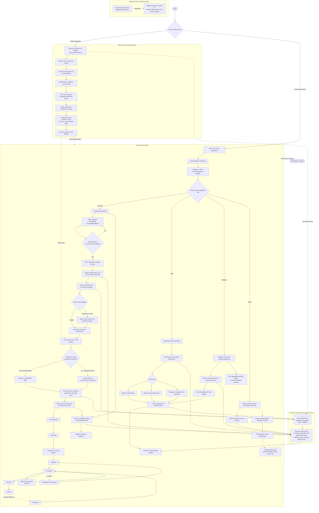

# ComplaintGuard Whole-Project Flowchart

This flowchart describes the current verified local-emulator prototype, the
offline model-training path, the live complaint lifecycle, role-specific
operations, and the boundary around deferred Cloud deployment. It does not
claim that Vercel, Hugging Face Spaces, or production Firebase is deployed.

## Stable routing labels

The classifier routes to one of these labels. Low-confidence or unsupported
automatic cases use `general_support` or remain in `Manual Review` according to
the current runtime contract.

`transfer_payment` · `account_support` · `card_atm` · `fraud_security` ·
`loan_credit` · `general_support`

## Security and data notes

- Firebase Auth supplies the identity token; FastAPI performs trusted workflow
  authorization and Firestore rules enforce direct client access boundaries.
- Historical CFPB records and training data stay local and are never bulk-loaded
  into Firestore.
- Use synthetic identities and complaints for demonstrations. Do not submit
  passwords, PINs, or full account/card numbers.
