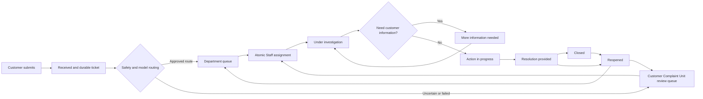
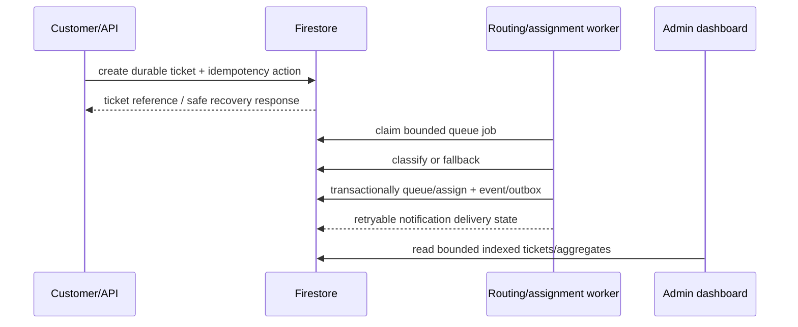

# ComplaintGuard Version 2 Implementation Plan

Status: planning and migration design only. No Version 2 production code,
Firestore rules, indexes, model artifacts, data, emulator state, deployment,
or configuration is changed by this document.

## Evidence labels used in this plan

| Label | Meaning |
|---|---|
| **Verified V1 fact** | Directly observed in this repository or in a committed evidence artifact. |
| **Public reference** | Information published on an official public AYA Bank page; it does not reveal private implementation. |
| **Project assumption** | A working assumption that needs owner or domain confirmation. |
| **V2 recommendation** | A proposed ComplaintGuard behavior or improvement, not a claim about AYA Bank. |

This plan is for an AYA Bank-style Myanmar banking complaint workflow. It does
not claim to reproduce AYA Bank's confidential, official, or internal process.
The public AYA grievance material describes fair, courteous, private,
prioritized, and timely handling; recording and forwarding complaints to
relevant departments; escalation information; and progress updates when a
complaint remains unresolved after one week. It also describes public contact
channels. Those principles are the only AYA-specific facts used here. Private
department names, staffing, queues, SLAs, systems, and approval paths remain
unknown. See the official public reference: [AYA Bank Grievance Handling](https://www.ayabank.com/grievance-handling).

## 1. Current Version 1 baseline

### 1.1 Repository and runtime boundary

**Verified V1 facts**

- The current branch is `upgrade/v2-aya-complaint-workflow`.
- The verified runtime is a local Next.js frontend, local FastAPI service,
  Firebase Authentication Emulator, Firestore Emulator, and a local frozen
  model. Cloud project `complaintguard` is preserved as a possible future
  staging boundary but is not connected or runtime-verified.
- The project remains cost-controlled: no billing attachment, paid API, paid
  hosting, Cloud Function, production deployment, or dependency installation is
  authorized by this planning task.
- Operational history must remain in Firestore. In-memory backends exist for
  pure tests and development only and are not operational persistence.
- CFPB historical data is used for analysis/training, not imported into
  Firestore. Tracked artifacts contain aggregate evidence rather than raw
  complaint narratives or real customer information.

### 1.2 V1 roles and permissions

**Verified V1 facts**: the repository recognizes `customer`, `staff`,
`manager`, and `admin`.

| Capability | Customer | Staff | Manager | Admin |
|---|---:|---:|---:|---:|
| Submit complaint | Yes | No | No | No |
| Read own tickets through API projection | Yes | No | No | No |
| Read/update assigned department tickets | No | Yes | No | No |
| Read all tickets / analytics | No | No | Yes | Partial/backend and planned UI slices |
| Manual-review list and department override | No | No | Yes | No |
| Provision accounts and lifecycle actions | No | No | No | Local trusted slices |
| Direct Firestore ticket/message/event writes | No | No | No | No |

Firestore rules deny direct client reads and writes for protected ticket data;
trusted FastAPI code uses the Admin SDK and must therefore enforce
authorization itself. Public Customer registration creates Customer profiles;
Admin provisioning creates pending Staff/Manager profiles. Admin is not yet a
complete operational workforce-management dashboard.

### 1.3 V1 taxonomy and model evidence

**Verified V1 facts**

V1 uses six stable proxy labels derived deterministically from CFPB Product and
Issue fields:

| V1 ID | Display label |
|---|---|
| `transfer_payment` | Transfer & Payment |
| `account_support` | Account Support |
| `card_atm` | Card & ATM |
| `fraud_security` | Fraud & Security |
| `loan_credit` | Loan & Credit |
| `general_support` | General Support |

The frozen artifact is TF-IDF plus `MultinomialNB(alpha=0.5)`, model/dataset/
mapping version `v1`, with a SHA-256 integrity check and a frozen label order.
It must not be retrained, relabeled, replaced, or overwritten during planning
or migration design.

Day 18 evidence reports 29,942 held-out records: accuracy `0.827934`, macro
precision `0.707515`, macro recall `0.736204`, macro-F1 `0.692345`. The project
macro-F1 target of `0.70` was not achieved. The fraud/security proxy class is
72.868244% of the mapped data, transfer/payment recall is `0.436945`, and
general support F1 is `0.562597`. Confidence is the maximum model probability,
not calibrated correctness. Myanmar and mixed-language input remains review
evidence only; it is not approved for automatic production routing.

### 1.4 V1 complaint workflow

**Verified V1 facts**

1. A durable ticket is created before routing inference.
2. Input is normalized and classified as English, Myanmar, mixed, or
   unsupported by script.
3. Myanmar or mixed input is translated with the pinned local translator when
   available, then passed to the frozen English classifier.
4. Low confidence, Myanmar/mixed input, translation failure, unsupported input,
   and classifier failure become `manual_review`.
5. Manual-review tickets are associated with Manager notifications; there is no
   durable fallback department queue.
6. Staff can reply, request reassignment/escalation, and resolve with a
   resolution summary. Reopen is not implemented and closed transition is not
   exposed through the Staff API.
7. Customer feedback is supported for resolved tickets.

Current statuses are `submitted`, `triaged`, `in_progress`,
`awaiting_customer`, `resolved`, and `closed`. `assignedStaffId` exists in the
ticket shape but automatic Staff assignment is not implemented.

### 1.5 V1 schema and security evidence

**Verified V1 facts**: current code uses `users`, `departments`, `tickets` with
`messages`, `events`, and `actions` subcollections, `feedback`,
`notifications`, `dashboardSummaries`, and several trusted lifecycle/action
collections. `docs/firestore_schema.md` also contains historical design names;
the current code uses `dashboardSummaries`, not the old `dashboard_stats` name.

The local Emulator test suite covers Auth/profile boundaries, Customer ticket
ownership, Staff department isolation, Manager access, trusted adapters,
account lifecycle pure tests, and denied direct client writes. It does not
prove Cloud deployment, production security, production workload scale,
background workers, retention automation, or disaster recovery.

## 2. Confirmed Version 2 requirements

The following requirements are treated as fixed for planning:

1. Model a realistic Myanmar banking complaint workflow without claiming AYA
   private or official internal procedures.
2. Replace CFPB proxy departments with a Myanmar-banking-oriented taxonomy,
   while preserving the ability to display V1 labels and history.
3. Remove Manager from the final active operational workflow, but do not
   immediately delete Manager code, profiles, or historical records.
4. Route automatically when evidence is sufficient; route every uncertain,
   failed, unsupported, or unsafe case to a Customer Complaint Unit fallback or
   review queue that does not require a Manager account.
5. Assign fairly to eligible active individual Staff accounts with atomic
   concurrency control, retry safety, capacity and availability handling, and
   complete assignment history.
6. Allow only Admin to create department identities and Staff accounts. A
   department identity is a service/workspace record, never an untraceable
   shared human login.
7. Preserve Staff profiles and history through suspension, leave, departure,
   and archival; never hard-delete Staff records.
8. Give Admin workforce management, department queue inspection, evidence-based
   analytics, filtered CSV export, and immutable audit records.
9. Continue using Firebase Authentication and Cloud Firestore unless later
   evidence proves a migration necessary. Firestore is a NoSQL document
   database: it has collections/documents/subcollections and indexes, not SQL
   tables and joins.
10. Preserve the frozen V1 English model and evidence. Myanmar classification
    requires a separate legally and ethically sourced dataset/model track.
11. Until minimum Myanmar evidence is accepted, Myanmar and mixed complaints
    stay in the safe fallback/review workflow.
12. A model, worker, notification, or Cloud runtime failure must not lose a
    durable complaint.

## 3. Assumptions requiring confirmation

These are not silently adopted facts:

| Decision | Working assumption | Confirmation needed from |
|---|---|---|
| Taxonomy | Eight provisional service categories are enough for the MVP. | Owner/domain reviewer |
| Fallback | Customer Complaint Unit is a normal department/workspace with a review queue. | Owner |
| SLA clock | Business hours are not known; initial targets below are elapsed-time demo policies. | Owner/domain reviewer |
| Priority | Fraud/unauthorized activity is urgent; other priority is rule-based. | Security/domain reviewer |
| Staff visibility | Staff see their assigned tickets plus eligible queue items in their departments. | Owner/security reviewer |
| Claiming | Automatic assignment is primary; optional Staff claim requires an atomic transaction. | Owner |
| Availability | Heartbeat plus explicit availability is sufficient for an MVP. | Owner/operations reviewer |
| Reopen | Customer may reopen a closed complaint within a configurable window with a reason. | Owner |
| Analytics freshness | Live ticket counts plus daily/monthly aggregates provide an acceptable balance. | Owner |
| Retention | Audit history is longer-lived than notifications; exact periods remain policy decisions. | Owner/legal reviewer |
| Myanmar model | No automatic Myanmar routing until locked bilingual evidence passes gates. | Owner/ML reviewer |
| Hosting | Local Emulator/FastAPI remains the first V2 implementation boundary. | Owner |

## 4. Proposed role model

### 4.1 Active V2 roles

**V2 recommendation**: the final active operational roles are only `customer`,
`staff`, and `admin`.

| Role | Main responsibility | Explicit limits |
|---|---|---|
| Customer | Submit complaints, view own status/messages, provide requested information, give feedback, reopen where policy allows. | Cannot change routing, priority, ownership, status, audit, or another Customer's data. |
| Staff | Investigate and respond to tickets assigned to the Staff member; work eligible department queue items; request information, reassignment, or escalation. | Cannot edit role, department membership, model evidence, audit events, or another department's work. |
| Admin | Provision/manage departments and Staff, inspect all operational queues, manage safe lifecycle actions, operate reports and exports, and perform audited exceptional reassignment. | Must not silently edit history or use a shared department login; Admin actions require reason and audit. |

The Customer Complaint Unit is a department, not a role. It may have ordinary
Staff members. There is no Manager dependency for low-confidence review.

### 4.2 Staged Manager removal

Manager is a retired V1 role, not an immediately deleted record:

1. Add `workflowVersion`/`rolePolicyVersion` and a compatibility reader before
   changing authorization.
2. Freeze Manager profiles, prevent new V2 provisioning, and stop creating new
   Manager notifications or routes.
3. Convert active manual-review ownership to the Customer Complaint Unit queue,
   retaining original prediction, `routingSource`, reason, actor, and a
   migration event.
4. Keep Manager code, schemas, UI fixtures, profile documents, and historical
   actor snapshots readable behind a V1-history compatibility boundary.
5. Deny Manager access to new V2 operational endpoints only after historical
   rendering and migration tests pass.
6. Archive Manager profiles with a lifecycle state such as `archived_v1`; never
   delete their identity or ticket events.
7. Remove active Manager implementation only in a later cleanup phase, after a
   rollback window and explicit approval. The code may remain disabled longer
   than the role remains operational.

## 5. Proposed department taxonomy

This is a provisional ComplaintGuard taxonomy, not an AYA Bank department list.
IDs are new V2 IDs and must not overwrite V1 IDs.

| V2 department ID | Customer-facing name | Included categories | Initial priority | Proposed first-response / resolution target |
|---|---|---|---|---|
| `account_branch_services` | Account & Branch Services | Account access, branch service, cash/service requests, general account servicing | Normal; high if access is blocked | 1 business day / 5 business days |
| `cards_atm_pos` | Cards, ATM & POS | Card issue, ATM cash/retention, POS decline, card delivery/activation | High if card is blocked; urgent if suspected loss | 4 hours / 2 business days |
| `mobile_internet_banking` | Mobile & Internet Banking | App login, digital channel errors, bill-pay/digital service defects | High when access or payment is blocked | 4 hours / 2 business days |
| `transfers_payments_remittance` | Transfers, Payments & Remittance | Transfer pending/failure, payment posting, remittance receipt | High when money is blocked; urgent if duplicate/unknown debit | 4 hours / 3 business days |
| `loans_credit` | Loans & Credit | Loan application, repayment posting, interest/fee query, credit servicing | Normal; high near a payment deadline | 1 business day / 5 business days |
| `fraud_scam_unauthorized` | Fraud, Scam & Unauthorized Transactions | Unauthorized transaction, phishing/scam, account takeover, suspicious card/transfer | Urgent by default | 1 hour / immediate containment plus case-specific follow-up |
| `kyc_verification_restrictions` | KYC, Verification & Account Restrictions | Identity verification, profile mismatch, account restriction, document review | High if service is blocked | 1 business day / 5 business days |
| `general_complaints` | Customer Complaint Unit | Ambiguous, cross-department, service conduct, unsupported/failed classification, review cases | High when unresolved or repeated; otherwise normal | 1 business day / 5 business days |

Category and subcategory labels should be versioned separately from department
IDs. A complaint may have one primary category and an optional secondary
category; the department is the accountable queue, not necessarily the entire
business owner.

### 5.1 Routing rules

1. Apply deterministic safety rules before ML. Suspected unauthorized activity,
   account takeover, scams, or credential compromise goes to
   `fraud_scam_unauthorized` and urgent handling; the system must not request a
   password, PIN, full card number, or full account number.
2. Apply explicit channel/entity terms for card/ATM/POS, digital banking,
   transfer/payment/remittance, loan/credit, KYC/restriction, and branch/account
   service.
3. Run the versioned classifier only against the approved taxonomy and model
   version. Store predicted category, department, confidence, model version,
   input language, and routing reason.
4. If confidence is below the approved calibrated threshold, classes conflict,
   the input is unsupported or mixed without approved evidence, translation
   fails, the model fails, or the taxonomy is unmapped, route to
   `general_complaints` with `routingOutcome=fallback` or `failed`.
5. A final Staff or Admin correction creates a new event and final department;
   it never rewrites the original prediction.

### 5.2 Priority and escalation rules

Priority is a triage policy, not a model label. Urgent cases include suspected
fraud/account takeover, active unauthorized transactions, safety/security
incidents, or a regulatory/legal deadline explicitly identified by an
authorized Staff member. High includes blocked access, money movement blocked,
repeated unresolved contact, or a near-due loan/payment problem. Normal covers
routine service and information complaints. Admin may override priority only
with a reason and audit event.

**Proposed escalation:** urgent cases alert the department queue immediately and
must be acknowledged within one hour; any missed first-response target, repeat
reopen, unresolved urgent case, or customer request for escalation creates an
escalation event and Admin notification. After seven elapsed days without
resolution, the system sends a progress-update reminder and records it. These
are proposed system policies inspired by the public reference, not AYA SLAs.

## 6. Proposed complaint lifecycle and status model

### 6.1 Customer-visible statuses

Use plain English and Myanmar localized labels, with a short explanation and
next action:

| Status ID | Customer label | Meaning |
|---|---|---|
| `received` | Received | We saved your complaint and gave it a ticket number. |
| `queued` | In queue | The appropriate team is being selected or the team is at capacity. |
| `assigned` | Assigned to a support staff member | A named support worker owns the next action internally; customer sees only safe display text. |
| `under_investigation` | Under investigation | Staff is checking records and facts. |
| `additional_information_required` | More information needed | The team asked the customer a specific safe question. |
| `action_in_progress` | Action in progress | The team is carrying out the response or correction. |
| `resolved` | Resolution provided | Staff recorded a resolution and invited customer feedback. |
| `closed` | Closed | The case is complete or was closed under the stated policy. |
| `reopened` | Reopened | The customer or authorized Staff reported that more work is needed. |

Internal queue state (`queued`, `assigned`, `deferred`, `escalated`) and
customer-visible status should not be conflated. A fallback ticket remains a
normal customer ticket, not an error page.

### 6.2 Lifecycle

Transitions:

| From | Allowed destinations | Required evidence |
|---|---|---|
| `received` | `queued` | Routing outcome and queue event |
| `queued` | `assigned` | Atomic assignment record |
| `assigned` | `under_investigation`, `additional_information_required` | Staff action |
| `under_investigation` | `action_in_progress`, `additional_information_required`, `resolved` | Staff action and reason |
| `additional_information_required` | `under_investigation` | Customer response or Staff decision |
| `action_in_progress` | `resolved` | Resolution summary and actor |
| `resolved` | `closed`, `reopened` | Closure reason or reopen reason |
| `closed` | `reopened` | Customer/authorized Staff reason within policy |
| `reopened` | `queued`, `assigned` | Re-routing or preserved valid assignment |

Every change writes an immutable event and notification. Reopening preserves
old `resolvedAt`/`closedAt` values in history and uses new timestamps for the
new cycle. Closure requires a non-sensitive resolution summary and closure
reason. Customer response to an information request returns the ticket to
investigation. There is no silent transition on a browser-only timer.

## 7. Automatic routing and Staff assignment algorithm

### 7.1 Assignment inputs

An eligible candidate must have:

- role `staff` and lifecycle `active`;
- login enabled and a valid membership in the routed department;
- explicit availability `available` and a recent heartbeat within the agreed
  timeout;
- `activeWorkload < maxConcurrentTickets`;
- no suspended, archived, or conflicting assignment lock;
- language skill matching the complaint where possible (`my`, `en`, or both).

If no language match exists, assign a qualified available Staff member and
record the language mismatch as an operational observation; do not strand the
ticket.

### 7.2 Selection order

The dispatcher processes highest priority first, then oldest queued ticket. For
each ticket it ranks eligible Staff by:

1. language match;
2. lowest workload ratio (`activeWorkload / capacity`);
3. availability/shift suitability;
4. longest time since last assignment;
5. stable department round-robin sequence;
6. immutable Staff identity ID as the final tie-breaker.

This is a fair workload policy, not a performance ranking. Admin reports must
warn that complaint volume alone must never determine bonuses, punishment, or
employment decisions.

### 7.3 Atomic transaction and retry safety

The trusted backend reads the ticket, queue state, candidate Staff documents,
and idempotency action inside a Firestore transaction. It then rechecks:

1. ticket is still `queued` and has no active assignment;
2. candidate is still active, available, a department member, and below
   capacity;
3. assignment attempt and queue version are unchanged;
4. deterministic action ID/idempotency key is unused or has the same request
   fingerprint.

The transaction atomically updates the ticket assignment, increments the
Staff workload, advances queue sequence, writes an assignment history record,
writes a ticket event/action, and creates deduplicated notifications. Firestore
transaction retry on contention is bounded. A conflict re-reads fresh state;
it never blindly repeats a stale write. Duplicate requests return the original
result. A failed notification is retried independently and cannot undo a
committed assignment.

If all candidates are at capacity, offline, or suspended, the ticket remains in
the department queue with `assignmentDeferredReason`, an overdue/retry time,
and a department notification. A later dispatcher or explicit Admin recovery
retries it. If a Staff member becomes unavailable after assignment, the ticket
is safely released/reassigned in a transaction, with the previous owner kept
in history. Reassignment and escalation always create before/after snapshots.

### 7.4 Reliability boundary

The first local MVP may run a bounded dispatcher from FastAPI or an explicit
Admin/maintenance action. An always-on hosted worker is not claimed while the
project remains Emulator-only and no-cost. No ticket may depend on a browser
tab staying open.

## 8. Firestore NoSQL schema

Firestore uses collections of documents, nested subcollections, document IDs,
and indexes. The following is a proposed schema; it does not authorize changing
`firebase/firestore.rules` or `firestore.indexes.json` in this task. The ticket
document is authoritative; queue and aggregate documents are derived aids.

### 8.1 Core collections

| Collection/document | Important fields | Relationship and authority |
|---|---|---|
| `users/{uid}` | `uid`, `role`, `active`, `loginEnabled`, `locale`, `displayName`, `employmentStatus`, `departmentIds`, `availability`, `maxConcurrentTickets`, `activeWorkload`, `lastHeartbeatAt`, timestamps | Auth profile; role and status authority. Never client-writable. |
| `departments/{departmentId}` | stable ID, localized names, active, fallback flag, routing policy, priority/SLA policy, assignment policy, timestamps | Department/workspace metadata. IDs never repurposed. |
| `departments/{id}/members/{uid}` | staff identity, membership state, language skills, shift, capacity override, joined/ended timestamps | Department membership projection. |
| `departments/{id}/queueState/current` | queued/assigned counts, oldest queue time, assignment sequence, version, updated time | Reconciliation/optimization aid; not history or authority over tickets. |
| `staffProfiles/{uid}` | employee code, name, position, contact, department IDs, employment state, languages, shift, capacity, created/updated timestamps | Human Staff profile; no hard delete. |
| `staffIdentities/{identityId}` | immutable historical name/code/department snapshot, UID link, effective dates, profile version | Reporting identity preserved after profile edits/departure. |
| `tickets/{ticketId}` | owner, redacted text, language, category, V1/V2 taxonomy versions, model fields, routing outcome/reason, department, queue state, priority, status, assignment, SLA timestamps, reopen count, timestamps | Authoritative operational document; server-only mutation. |
| `tickets/{id}/messages/{messageId}` | author UID/role snapshot, redacted body, language, visibility, created time | Ticket-scoped conversation. |
| `tickets/{id}/events/{eventId}` | event type, actor/service identity, role snapshot, before/after status/department/assignment, reason code, correlation ID, time | Immutable ticket history. |
| `tickets/{id}/actions/{actionId}` | action type, actor, request fingerprint, result fingerprint, state, timestamps | Idempotency and mutation evidence. |
| `tickets/{id}/assignments/{assignmentId}` | from/to Staff identity, department, reason, attempt, algorithm version, timestamps | Immutable assignment history. |
| `feedback/{feedbackId}` | ticket, customer, rating, safe comments, submitted time | Customer feedback; no HR automation. |
| `notifications/{notificationId}` | recipient type/id, ticket/event reference, type, severity, localization keys, dedupe key, read/expiry timestamps | Durable retryable notification projection; finite retention. |
| `auditLogs/{auditId}` | actor snapshot, action, target, before/after allowlisted fields, reason, correlation ID, timestamp, privacy class | Immutable Admin/system audit; no complaint text by default. |
| `dailyMetrics/{yyyy-mm-dd}` | dimensions by department/category/status/priority/language/Staff, counts, duration sums, completeness/version | Stored aggregate for bounded reporting. |
| `monthlyMetrics/{yyyy-mm}` | same dimensions plus month totals and version | Stored long-term aggregate. |
| `taxonomyVersions/{version}` | taxonomy IDs/names, category rules, effective dates, fallback ID, checksum, status | Versioned routing vocabulary; immutable once adopted. |
| `modelVersions/{version}` | model/dataset/mapping version, algorithm, artifact hash, languages, threshold/calibration, approval/readiness, metrics | Model registry metadata; artifacts remain controlled files. |
| `queueJobs/{jobId}` | job type, target ticket, idempotency key, state, attempts, next retry, lease, error code | Bounded routing/assignment/aggregate retry work. |
| `reportRuns/{reportId}` | Admin actor, normalized filters, row count, export hash, status, timestamps | Audit trail for report/CSV generation. |

### 8.2 Ticket field design and version compatibility

Every new ticket should include `schemaVersion`, `workflowVersion`,
`taxonomyVersion`, `modelVersion`, and `legacySource` where applicable. Preserve
V1 fields such as `predictedDepartmentId`, `routingSource`, `manualReviewReason`,
`assignedStaffId`, and original status. Add `legacyDepartmentId` and
`legacyStatus` rather than replacing values. A V1 ticket may have null V2
category/model fields and must still render correctly.

`users/{uid}.departmentId` may be read for V1 compatibility while new V2
records use `departmentIds` and `staffProfiles`. A stable UID and immutable
historical Staff identity are more important than a mutable display name.

### 8.3 Authorization boundaries

- Customer: only own ticket projection, participant-safe messages/timeline,
  feedback, and approved reopen action.
- Staff: assigned tickets and department queue within membership and lifecycle
  policy; no raw cross-department access.
- Admin: all operational projections and audited management functions.
- Department records: safe localized metadata may be broadly readable;
  membership, workload, audit, and queue internals are trusted/admin scoped.
- Model versions, audit logs, assignment records, and queue jobs are not direct
  client-write surfaces.
- Firestore rules must remain deny-by-default for protected writes; API
  authorization and transaction invariants remain mandatory because the Admin
  SDK bypasses rules.

### 8.4 Transaction boundaries and retention

One ticket mutation transaction should include the ticket precondition, action
idempotency record, event, relevant assignment/workload change, and notification
outbox entry. Aggregates may be updated in a separate retryable transaction
from immutable events, with a reconciliation job. Do not put full complaint
text into general audit logs or metrics.

Proposed policy: notifications expire after 90 days; immutable ticket/audit/
assignment history follows an owner-approved legal/operational retention policy;
daily/monthly aggregates outlive notification records but contain no complaint
text. Backup and deletion policies require explicit review before Cloud use.

## 9. Admin account and Staff-profile design

Only an active Admin through trusted backend code can create department records,
department service identities, Staff Auth identities, and Staff profiles.
Public clients may not submit a role or department to create a privileged
profile.

Required at Staff creation:

- legal/work display name approved for operational use;
- unique employee code;
- individual email/Auth identity;
- department membership;
- position;
- employment state, initially `invited`;
- supported language skills;
- shift/time-zone policy;
- maximum concurrent-ticket capacity;
- inviter Admin, creation time, and profile version.

Optional or completable later: avatar, preferred display name, phone/contact
extension, branch/location, secondary language proficiency, shift exceptions,
training/certification notes, and notification preferences. Sensitive identity
documents are out of scope for this prototype.

Staff lifecycle is `invited`, `active`, `suspended`, `on_leave`, or `archived`.
Suspending login does not delete profile/history. Archiving removes assignment
eligibility, safely drains or reassigns active work, and retains historical
identity snapshots. A department service identity is a non-human record used
for queue ownership/system actions; it must never authenticate several humans.
Every human reply and status/assignment action records the human Staff UID and
historical identity snapshot.

Admin profile view should show current workload, assignment history, resolved
complaints, median and average resolution time, SLA performance, reopen rate,
customer feedback, escalation rate, language/shift/capacity context, and data
completeness. Metrics need denominators, date range, status definitions, and
staleness markers. Complaint volume alone is not a fair performance measure and
must never automatically determine bonuses, discipline, or dismissal.

## 10. Admin dashboard and analytics design

The Admin landing dashboard shows today's received, assigned, pending/queued,
resolved, closed, reopened, overdue, and escalated counts by department. A
department drill-down opens its current queue, oldest ticket, priority mix,
capacity state, Staff assignment state, and safe ticket projections.

Filters: today, custom date range, month, year, department, category, status,
priority, language, and Staff member. Filters use explicit UTC/business-time
zone definitions and bounded ranges. CSV export is available only to Admin,
uses the exact filter snapshot, and writes a `reportRuns`/`auditLogs` record.

### 10.1 Live versus stored data

| View | Source | Reason |
|---|---|---|
| Current queue and current workload | Live bounded ticket/Staff queries | Operational accuracy now |
| Today's small summary | Live query plus aggregate reconciliation | Fresh demo view with detectable lag |
| Historical day/month counts | `dailyMetrics` / `monthlyMetrics` | Avoid repeated full-ticket scans |
| Exact drill-down list | Bounded indexed ticket/event query | Evidence behind aggregate |
| Average/median durations and reopen rate | Stored sums/counts plus bounded recomputation checks | Stable and scalable |
| Export | Snapshot of approved projection and filters | Reproducible, auditable report |

Aggregates are derived, never the sole source of truth. Each aggregate stores
schema/version, generated time, source watermark, completeness, and correction
count. Missing or stale aggregates show a warning rather than fabricated zero.

Default export fields should be allowlisted: ticket reference, dates,
department/category display names, language, priority/status, routing outcome,
confidence band, Staff historical ID/code, assignment count, first-response and
resolution durations, reopen count, and escalation flag. Exclude complaint text,
email, phone, UID, account/card/NRC/passport values, passwords, PINs, tokens,
raw model internals, and unredacted audit payloads. Escape CSV cells and prevent
spreadsheet formula injection.

## 11. Myanmar dataset and ML-development plan

Accurate Myanmar routing is the highest-priority V2 ML requirement. The V1
English CFPB model and Day 18 evidence remain frozen and are not evidence of
Myanmar banking performance.

### 11.1 Data acquisition and ethics

Use only data with documented permission: owner-authored synthetic cases,
publicly licensed complaint data after license review, de-identified opt-in
customer cases under an approved consent notice, or an approved institutional
partner dataset. Do not scrape private customer channels, copy real account
details, or describe translated/synthetic records as real customer data.

Consent must state purpose, languages, retention, access, withdrawal where
feasible, and whether data may train a classifier. Remove names, phone/email,
NRC/passport numbers, account/card numbers, transaction references, addresses,
credentials, URLs, and free-form identifiers. Keep raw source material outside
the repository in a controlled location; repository artifacts should be
privacy-reviewed aggregates, manifests, hashes, and clearly marked synthetic
examples.

### 11.2 Labeling protocol

Each case records `caseId`, source type (`real_public`, `consented`,
`translated`, `synthetic`), license/consent reference, language/script mix,
redaction status, primary/secondary category, priority only if independently
labeled, duplicate groups, annotator hashes, round, disagreement, adjudication,
and split. At least two bilingual reviewers independently label each case;
disagreements go to a third adjudicator. Freeze the test set before tuning.
Publish class counts and agreement by language/category, not customer text.

Prevent leakage with exact normalized duplicate removal, near-duplicate review,
source/customer-group separation, and train/validation/test splits that keep a
case family in one split. Keep synthetic and translated augmentation flagged
and report results with and without augmentation.

### 11.3 Development and evaluation

Required baseline remains TF-IDF plus MultinomialNB to honor the project
constraint. Compare against a simple majority/keyword baseline and, only if
approved, a separately documented bilingual representation. Evaluate English,
Myanmar, mixed, and unsupported input separately with accuracy, macro precision,
macro recall, macro-F1, per-class precision/recall/F1, confusion matrix,
coverage, fallback rate, calibration error/reliability plots, and high-risk
fraud false-negative analysis. Validate thresholds on validation data only.

Register every candidate in `modelVersions` with dataset/mapping versions,
artifact hash, preprocessing, language support, threshold, calibration method,
training split, reviewer approval, and limitations. Monitor class distribution,
language mix, confidence/calibration, fallback rate, routing corrections,
reopens, and drift. Drift triggers review and fallback; it does not silently
retrain or promote a model.

### 11.4 Minimum gate for Myanmar automatic routing

Myanmar/mixed automatic routing remains disabled until all are true:

1. A legally documented, privacy-reviewed dataset exists with enough reviewed
   examples in every V2 category and a meaningful fallback class.
2. Dual-review agreement and adjudication records pass the approved threshold.
3. Exact and near-duplicate leakage checks pass, with frozen untouched test data.
4. Per-language and per-category metrics, confusion matrix, and calibrated
   confidence are reviewed; fraud/security false negatives meet the stricter
   safety threshold.
5. Locked synthetic/consented operational cases pass routing, translation
   failure, mixed script, unsupported script, and model outage tests.
6. Owner/domain/ML/privacy reviewers approve taxonomy, threshold, artifact hash,
   rollback model, and fallback queue behavior.

Until then, Myanmar and mixed complaints are durably saved and routed to
`general_complaints` with a review reason. No synthetic, translated, or small
diagnostic result is called customer-data evidence or production readiness.

## 12. Scalability and failure-handling plan

Many simultaneous submissions are handled by a durable write-first flow:

Required controls:

- Client-provided action/idempotency keys bound to Customer, operation, and
  request fingerprint.
- Bounded queue jobs with maximum attempts, lease/heartbeat, backoff, dead-letter
  or operator-review state, and no unbounded in-memory list.
- Model loaded once at process startup/lazy first use and reused for inference;
  never retrained or loaded per request.
- Bounded text length, request rate limits, worker concurrency, and queue depth.
- Firestore transactions for ticket ownership, Staff capacity, lifecycle
  preconditions, and idempotent actions.
- Retryable notification outbox; notification failure cannot delete or roll
  back the complaint.
- Graceful model failure: ticket remains saved, route to fallback with a clear
  reason, and create an Admin system alert.
- Graceful Firestore outage: return a safe unavailable response only when the
  durable write did not commit; never claim a ticket was created without a
  confirmed or recoverable idempotency result.
- Monitoring for queue age, assignment conflicts, retries, capacity overflow,
  model readiness, fallback rate, notification failures, aggregate lag, and
  authorization denials.

Backup/recovery, restore drills, retention, and production SLOs require a later
approved environment. The Emulator must test outage simulation, duplicate
requests, transaction contention, worker retry, model unavailable, notification
failure, and no-loss recovery before any Cloud decision.

## 13. Security and audit requirements

- Enforce role, lifecycle, department membership, ownership, and Staff identity
  in trusted backend code and Firestore rules; UI visibility is not security.
- Keep all privileged creation and mutation behind active Admin authorization.
- Never use a shared human department login. Department service identities are
  non-human system records and cannot attribute human actions.
- Redact sensitive text at ingestion and again before messages, events, logs,
  exports, and analytics. Warn Customers not to submit passwords, PINs, full
  account/card numbers, NRC/passport numbers, or secrets.
- Immutable audit records include actor UID plus historical identity snapshot,
  role-at-time, action, target, before/after allowlisted fields, reason,
  correlation ID, request ID, and timestamp. Audit records are create-only.
- Use deterministic idempotency records and safe error messages; never expose
  credentials, tokens, raw UIDs, internal stack traces, or model internals to
  Customers.
- Audit report generation, Staff lifecycle changes, assignment/reassignment,
  escalation, status changes, model promotion, fallback changes, and Admin
  access to sensitive projections.
- Keep `cloud_staging_not_adopted`, no billing, no secrets, and synthetic-only
  runtime data until separately approved.

## 14. Backward-compatibility and migration strategy

Migration is additive and reversible:

1. Freeze and hash V1 model, mapping, label order, status parser, and evidence.
2. Add versioned readers and dual-display mappings. Never reinterpret a V1 ID as
   a V2 ID; for example, `account_support` remains a V1 label even if a V2
   ticket is routed to `account_branch_services`.
3. Add V2 fields alongside V1 fields. Preserve original prediction, confidence,
   routing source, manual-review reason, status, timestamps, actor IDs, and
   events. Write a migration event rather than editing history.
4. Migrate existing Manager manual-review tickets to the
   `general_complaints` queue only by an idempotent trusted script/service. Keep
   `legacyManagerReview=true`, original Manager references, and a migration
   report. Do not assign a replacement human without an assignment event.
5. Backfill queue state from tickets in bounded batches with checkpoints; queue
   aggregates are rebuildable and never replace ticket history.
6. Drain/reassign active work before Staff archival or department change. A
   former Staff profile remains readable, and historical reports use the
   `staffIdentities` snapshot.
7. Keep V1 read compatibility through the rollback window. Rollback disables
   V2 writes/routing/assignment but continues displaying all historical records.
8. Only after Emulator and controlled local acceptance may Manager active
   authorization/UI be disabled. Cleanup/deletion of dead code is a separate,
   later approved task and is not part of the first migration.

## 15. Testing strategy

Tests remain local and synthetic in the initial V2 phases.

| Area | Required proof |
|---|---|
| Domain contracts | V1 and V2 parsing, stable IDs, localized labels, unknown/versioned fields, status transition matrix |
| Routing | Safety precedence, every taxonomy class, low confidence, Myanmar/mixed fallback, unsupported input, translation/model failure, durable no-loss ticket |
| Assignment | Priority/age order, language match, capacity, availability timeout, fairness, round-robin tie-break, all-busy queue, reassignment, archival, duplicate requests |
| Concurrency | Firestore transaction races with two workers, one owner only, workload never over capacity, retry idempotency |
| Lifecycle | Valid/invalid transitions, information request/response, resolve/close/reopen, escalation, notifications and immutable events |
| Authorization | Customer ownership, Staff department isolation, Admin-only workforce/report/export, Manager denial after cutover, historical Manager read compatibility |
| Data/privacy | Redaction, sensitive-field warnings, CSV allowlist/formula injection, no raw CFPB import, no secrets, audit payload safety |
| Analytics | Live/aggregate reconciliation, filters, range bounds, stale/missing aggregates, denominators, export audit |
| ML | Leakage, class balance, per-language metrics, calibration, drift fixtures, frozen V1 hash/evidence, Myanmar gate failure behavior |
| Reliability | Queue backoff/lease, model unavailable, Firestore unavailable, notification failure, restart/recovery, bounded memory and rate limits |
| Emulator/E2E | Synthetic Auth/Firestore multi-user browser flows; no production or Cloud claim |

## 16. Phased implementation roadmap

Each phase is local-only unless a later owner approval explicitly changes the
boundary. The active developer must review changed files and record evidence
before marking a phase complete.

### Phase 0 — Approval and contract freeze

Files expected to change: `docs/v2_implementation_plan.md`,
`PROJECT_PLAN.md`, `docs/task_board.md`, and, if needed,
`README.md`/`docs/claim_evidence_matrix.md`.

Acceptance: owner confirms provisional taxonomy, fallback semantics, SLA policy,
role model, Manager disposition, reopen policy, privacy/retention, Myanmar
gates, and local-only boundary; no application behavior changes.

### Phase 1 — Shared V2 domain and compatibility contracts

Expected files: `ml-api/app/schemas.py`, `ml-api/app/account_state.py`, a new
versioned domain-contract module under `ml-api/app/`,
`frontend/src/lib/department-labels.ts`, `frontend/src/lib/i18n.ts`,
`frontend/src/lib/auth-policy.ts`, `docs/firestore_schema.md`, and matching
pure tests under `ml-api/tests/` and `frontend/src/lib/`.

Acceptance: V1 documents still parse/render; V2 IDs/statuses/localized labels
validate; Manager history is readable; no rules/index/model/data changes.

### Phase 2 — Taxonomy, policy, and Myanmar dataset preparation

Expected files: new versioned mapping/manifests under `data/mapping/` and
`data/processed/` (aggregate/privacy-reviewed only), `scripts/` mapping,
split, duplicate, and evaluation helpers, `docs/label_mapping.md`,
`docs/myanmar_pipeline.md`, `docs/model_evaluation.md`, and ML tests.

Acceptance: taxonomy mapping is deterministic; source/license/consent metadata,
dual-review process, exact/near-duplicate checks, class counts, and locked
split manifest exist; no Myanmar automatic routing is enabled; V1 artifact and
metrics hash/reconciliation remain unchanged.

### Phase 3 — Durable V2 routing and fallback queue

Expected files: `ml-api/app/routing.py`, `ml-api/app/ticketing.py`,
`ml-api/app/notifications.py`, `ml-api/app/main.py`, new routing/fallback
worker or queue module under `ml-api/app/`, `ml-api/tests/test_ml_routing.py`,
`test_ticket_submission.py`, notification tests, and frontend routing/status
projection files.

Acceptance: every submission has a durable routing outcome; approved English
routes use V2 model metadata, all uncertain/failure/Myanmar cases reach
`general_complaints`, no Manager account is needed, idempotent retry does not
duplicate tickets, and V1 history remains unchanged.

### Phase 4 — Department workspaces and atomic assignment

Expected files: new `ml-api/app/assignment.py`/queue module,
`ml-api/app/staff_workflow.py`, `ticketing.py`, `notifications.py`, Admin
directory/profile modules, related tests, and only after review the relevant
`firebase/firestore.rules` and `firestore.indexes.json` changes.

Acceptance: concurrent workers produce one owner; workload never exceeds
capacity; eligible language/availability/department/priority/fairness rules
work; all-busy tickets remain visible; reassignment, retry, escalation, and
archival preserve history. Rules/index changes require their own review and
Emulator evidence.

### Phase 5 — Manager retirement and historical compatibility

Expected files: `ml-api/app/manager_workflow.py`, `ml-api/app/main.py`,
`ml-api/app/notifications.py`, `ml-api/app/schemas.py`,
`frontend/src/lib/manager-workflow.ts`, Manager components/tests,
`frontend/src/lib/auth-policy.ts`, migration/checkpoint tooling, and rules only
after compatibility tests.

Acceptance: no new V2 endpoint, notification, fallback, or assignment depends
on Manager; Manager login is denied on active V2 paths; historical Manager
actor/events render; migrated manual-review tickets are in fallback; rollback
can restore V1 read behavior without deleting data.

### Phase 6 — Admin workforce management and analytics

Expected files: `ml-api/app/admin_*.py`, new analytics/export modules,
`ml-api/app/main.py`, `frontend/src/components/admin-*.tsx`, related frontend
libs/tests, `docs/firestore_schema.md`, analytics docs, and aggregate/CSV tests.

Acceptance: Admin-only Staff/department operations, immutable lifecycle,
profile evidence, dashboard filters, live/aggregate reconciliation, bounded
drill-down, safe CSV, and report audit logs pass synthetic tests. No HR
decision is automated and no raw complaint text is exported by default.

### Phase 7 — Customer lifecycle and bilingual experience

Expected files: `ml-api/app/customer_workflow.py`, `staff_workflow.py`,
`schemas.py`, `notifications.py`, customer/staff workflow frontend components,
`frontend/src/lib/i18n.ts`, and lifecycle tests/E2E fixtures.

Acceptance: plain-language bilingual statuses, safe information requests,
resolve/close/reopen policy, feedback, notification consistency, sensitive-data
warnings, and mobile/accessibility checks pass without weakening authorization.

### Phase 8 — Local reliability, Emulator acceptance, and packaging

Expected files: `firebase/*.test.js`, seed/fixture contracts, `ml-api/tests/`,
frontend E2E tests, `docs/final_test_report.md`, `docs/demo_guide.md`,
`docs/release_checklist.md`, and `README.md`.

Acceptance: full available local tests, Auth/Firestore Emulator multi-user
flows, race/retry/outage tests, backup/recovery limitation documentation,
privacy scan, `git diff --check`, and demonstrable V2 synthetic workflow pass.
Cloud remains unconnected and no billing is attached.

### Phase 9 — Separate future staging/production decision

Expected files only after separate approval: environment/configuration docs,
deployment manifests, reviewed rules/indexes, monitoring/backup configuration,
and production runbooks. No implementation is authorized by this plan.

Acceptance: explicit owner approval for budget, billing, hosting, credentials,
keyless identity, data retention, security review, and rollback; all Cloud
verification gates in `docs/cloud_firebase_staging_adoption.md` pass.

## 17. Risks, open questions, and rollback points

### Highest risks

- V2 categories may not match real bank ownership; confirm with domain review.
- Myanmar labels/data may be insufficient or legally unavailable; keep fallback.
- Fraud false negatives can cause harm; use deterministic safety rules and human
  review even if model confidence is high.
- Firestore transaction contention and aggregate/index cost can grow quickly;
  keep queries bounded and review indexes before changing them.
- Staff availability/capacity can be stale; use leases/heartbeats and queue
  fallback rather than unsafe assignment.
- Manager removal can strand history or authorization paths; migrate additively
  and retain compatibility.
- Admin analytics may encourage unfair ranking; show context and warnings.
- Spark/no-cost operation cannot honestly provide an always-on worker, backup,
  or production SLA without a separately approved runtime.

### Open questions

1. Are the eight provisional departments approved, and what localized names or
   subcategories are required?
2. Is Customer Complaint Unit a department, special queue, or both?
3. What business calendar, timezone, SLA clock, reopen window, and retention
   policy should apply?
4. May Staff manually claim queued tickets, and may Admin force assignment?
5. Should Staff see only assigned work or all department queue tickets?
6. Which language proficiency evidence is sufficient for assignment preference?
7. Which fraud cases must be held for human review regardless of confidence?
8. What is the minimum Myanmar sample size and per-class/per-language metric
   threshold for automatic routing?
9. Who can legally collect, label, retain, and adjudicate Myanmar complaints?
10. Which Admin users may view text versus redacted projections and exports?
11. How long should Manager history remain readable and which profiles become
    `archived_v1`?
12. What local worker/maintenance execution is acceptable before Cloud staging?

### Rollback points

- Before any schema writer: V1 readers and frozen artifacts remain untouched.
- Before V2 routing activation: disable V2 dispatcher and leave durable tickets
  in fallback; retain evidence.
- Before assignment activation: disable dispatcher; queues remain visible and
  no ticket history is deleted.
- Before Manager cutover: restore V1 Manager read path behind compatibility
  boundary if migration tests fail.
- Before analytics/export release: disable routes/UI while keeping tickets,
  aggregates, and audit logs.
- At all times: return to the verified local Emulator prototype; do not point
  seed/reset scripts at Cloud.

## 18. Recommended first implementation phase

Recommended first implementation is Phase 1: shared V2 domain contracts and
backward-compatible readers, after Phase 0 owner confirmation. It is the
smallest safe slice that establishes stable V2 IDs, statuses, role policy,
version metadata, immutable Staff identity, and V1 history parsing without
changing the frozen model, dataset, authentication rules, Firestore rules,
indexes, or runtime routing. It should be implemented and pure-tested before
taxonomy data, assignment transactions, Manager cutover, or UI replacement.

## Final planning record

This document is the stopping point for the requested migration-design phase.
Implementation must wait for owner approval of Phase 0 decisions and the
recommended Phase 1 scope.
